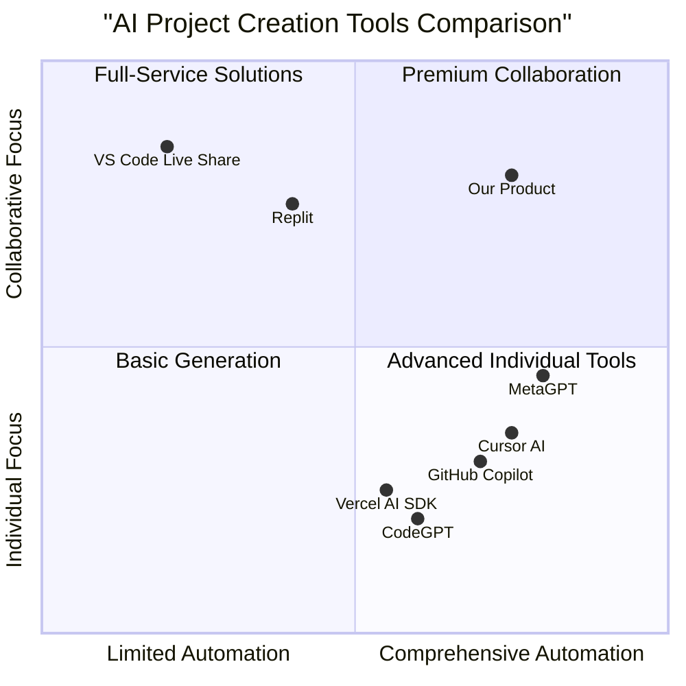

# Product Requirements Document (PRD): AI-Powered Multi-Agent Website/App Builder

## Project Overview

### Project Name: ai_collab_builder

### Original Requirements
Build a zero-cost, AI-powered "multi-agent" website/app builder with these features:

1. **User Input:** A web page where the user types a project description (e.g. "Create a React + Firebase chat app with login and admin dashboard") and clicks "Start."
2. **Agents & Roles:**
   * Emma (Product Manager) → generate `docs/PRD.md` (feature list, user stories, acceptance criteria).
   * Bob (Architect) → produce `docs/Architecture.md` (tech stack, folder structure, free-tier cloud setup).
   * Alex (Engineer) → create skeleton code files (`public/index.html`, `src/App.jsx`, `src/firebaseConfig.js`, etc.).
   * David (Data Analyst) → draft a Firestore data model and security rules (`src/utils/firestoreRules.js`) and an optional analytics component.
   * Mike (Team Leader) → review all outputs and write `README.md` (how to install and run locally).
3. **Output Format:** Each agent must return valid JSON containing `new_files` (array of `{ "path": "...", "content": "..." }`), optional `edits`, and a short `remarks` string.
4. **File Store & Versioning:** Use an in-memory or file-based JSON store (no paid databases). After each agent finishes, auto-snapshot the entire file tree as a timestamped JSON file. Provide a "Versions" list in the UI to restore any snapshot.
5. **Real-Time Collaboration:** Implement WebSocket (e.g., Socket.IO) so that when an agent writes or updates a file, connected clients instantly see the change in the file tree and editor.
6. **Front-End UI:**
   * Top "Team Bar" showing five avatars (Emma/PM, Bob/Architect, Alex/Engineer, David/Data Analyst, Mike/Team Leader) with a highlight for the active agent.
   * A prompt input box and "Start" button.
   * Left sidebar: collapsible file explorer (including a "Global Resources" folder of reusable boilerplate).
   * Center panel: open-source code editor (Monaco or CodeMirror, dark theme). Clicking a file loads its contents; users can manually edit and save.
   * Bottom console: scrollable log of agent actions (e.g., "Emma generated docs/PRD.md").
   * Footer: "Versions" button opening a modal with snapshot timestamps and "Restore" options.
7. **Back-End API:**
   * **`POST /api/start`**: `{ "userPrompt": "…" }` → returns `{ "projectId": "…" }` and triggers Emma.
   * **`POST /api/:projectId/agent/:agentName`**: Runs the specified agent with required context (e.g., PRD or Architecture). Parses its JSON, writes files, broadcasts WebSocket events.
   * **`GET /api/:projectId/files`**: Lists all file paths.
   * **`GET /api/:projectId/file?path=…`**: Returns `{ "content": "…" }`.
   * **`POST /api/:projectId/file`**: `{ "path": "...", "content": "...", "agent": "User" }` → saves a user edit and emits a WebSocket "fileUpdated" event.
   * **`GET /api/:projectId/versions`** & **`POST /api/:projectId/restore`**: Manage version snapshots stored as JSON.
8. **Free-Only Stack:** Use Node.js + Express + Socket.IO for the backend; React + Monaco/CodeMirror + Socket.IO client for the frontend; store snapshots as local JSON files (or SQLite/lowdb if needed); use OpenAI's free-tier GPT-3.5-turbo for all agent calls. No paid hosting—run locally or on free services (e.g., Vercel/Heroku free tiers).

## 1. Product Definition

### 1.1 Product Goals

1. **Maximize Developer Productivity**: Automate repetitive aspects of software project bootstrapping through multi-agent AI collaboration, allowing developers to focus on implementation details rather than boilerplate code creation.

2. **Democratize Application Development**: Lower the barrier to entry for creating well-structured software projects by providing AI-generated architecture, code scaffolding, and documentation that follows best practices.

3. **Foster Collaborative Development**: Create a real-time multi-user environment where teams can simultaneously contribute to and visualize the evolution of a software project from initial requirements to implementation.

### 1.2 User Stories

1. **As a solo developer**, I want to quickly scaffold a new project based on a simple text description, so that I can focus on implementing unique functionality rather than setting up boilerplate code and project structure.

2. **As a technical team lead**, I want to generate well-structured starter code and documentation for my team, so that we have a consistent foundation to build upon and clear architecture guidelines to follow.

3. **As a developer learning a new tech stack**, I want to generate a working example project with proper structure and documentation, so that I can understand best practices and architectural patterns.

4. **As a product manager**, I want to quickly prototype an application concept with minimal technical knowledge, so that I can validate ideas before committing engineering resources.

5. **As a development team**, we want to collaborate on a project in real-time with AI assistance, so that we can iterate quickly and maintain a shared understanding of the evolving codebase.

### 1.3 Competitive Analysis



#### GitHub Copilot
- **Pros**: Excellent code completion, integrated into popular IDEs, uses advanced AI models
- **Cons**: Primarily focused on code completion rather than full project generation, no explicit multi-agent system, lacks collaborative features, paid subscription required

#### Vercel AI SDK
- **Pros**: Simplifies AI integration into web applications, good documentation, free tier available
- **Cons**: Focus is on integrating AI into apps rather than building them, requires significant development knowledge

#### CodeGPT
- **Pros**: Generates code based on natural language descriptions, IDE integration, supports multiple programming languages
- **Cons**: Limited collaborative features, no multi-agent approach, not focused on full project generation

#### VS Code Live Share
- **Pros**: Excellent real-time collaboration, IDE integration, secure sharing
- **Cons**: No AI-powered code generation, focused purely on collaboration rather than project creation

#### Replit
- **Pros**: Browser-based development environment, collaborative features, deployment capabilities
- **Cons**: Limited AI assistance, primarily a coding environment rather than a project generation tool

#### Cursor AI
- **Pros**: AI-first code editor, strong code generation capabilities, chat interface
- **Cons**: Limited collaborative features, focused on individual productivity rather than team collaboration

#### MetaGPT
- **Pros**: Multi-agent approach, generates complete project structures, follows software development workflows
- **Cons**: Limited real-time collaboration features, primarily command-line focused, less emphasis on UI/UX

### 1.4 Target Audience

- **Individual developers** seeking to bootstrap new projects quickly
- **Development teams** looking for collaborative project creation tools
- **Technical leads** needing to establish project foundations and architecture
- **Startups** with limited resources wanting to accelerate development
- **Educators and students** learning software development practices
- **Product managers** looking to create technical prototypes

## 2. Technical Specifications

### 2.1 Requirements Analysis

The AI Multi-Agent Website/App Builder will consist of three major components:

1. **User Interface**: A web application with real-time collaborative features, file exploration, and code editing capabilities.

2. **Backend API**: A service handling agent orchestration, file management, and real-time updates.

3. **Multi-Agent System**: A collection of specialized AI agents working together to generate a complete project structure.

Key technical challenges include:
- Implementing a robust multi-agent architecture with clear handoffs between agents
- Creating an efficient real-time collaborative editing system
- Building a reliable file versioning system without relying on paid databases
- Ensuring the system works entirely on free-tier services
- Developing a responsive and intuitive user interface for project generation and management

### 2.2 Requirements Pool

#### P0 (Must Have)

1. **User Input System**
   - Text input area for project description
   - "Start" button to initiate project generation
   - Status indicators showing current progress

2. **Multi-Agent System**
   - Implementation of all five specialized agents (Emma, Bob, Alex, David, Mike)
   - Sequential workflow triggering agents in the correct order
   - Proper context sharing between agents

3. **File Generation & Management**
   - JSON-based file representation (`{path, content}`)
   - In-memory or file-based storage system
   - Basic version control with auto-snapshots

4. **Real-Time Updates**
   - WebSocket implementation for file changes
   - Event broadcasting when files are created or modified
   - Connection state management

5. **User Interface Components**
   - Team avatar bar with active agent indication
   - File explorer sidebar with folder structure
   - Code editor with syntax highlighting
   - Console log showing agent activities
   - Version history access

6. **Core API Endpoints**
   - Project initialization endpoint
   - Agent execution endpoints
   - File management endpoints (list, get, update)
   - Version management endpoints

7. **Local Deployment**
   - Complete setup instructions for local installation
   - Environment configuration documentation
   - Free-tier technology stack implementation

#### P1 (Should Have)

8. **File Editor Enhancements**
   - Syntax highlighting for multiple languages
   - Line numbering and code folding
   - Basic search and replace functionality

9. **Project Configuration**
   - Ability to customize agent parameters
   - Technology stack preferences
   - Project naming and metadata

10. **Enhanced Versioning**
    - Diff viewer between versions
    - Named snapshot capability
    - Partial restoration of files

11. **User Authentication**
    - Basic user accounts
    - Project ownership and access control
    - Session management

12. **Extended Agent Capabilities**
    - Enhanced context understanding
    - Ability to refine outputs based on feedback
    - Support for more technology stacks

#### P2 (Nice to Have)

13. **Multi-User Collaboration**
    - User presence indicators
    - Per-user cursors and selections
    - User-specific action logging

14. **Advanced Code Editor Features**
    - Auto-completion suggestions
    - Error and warning highlighting
    - Code formatting tools

15. **Export Functionality**
    - Download project as ZIP
    - Export to GitHub repository
    - Generation of deployment scripts

16. **Agent Customization**
    - User-defined agent roles and responsibilities
    - Custom agent creation
    - Agent behavior configuration

17. **Project Analytics**
    - Generation statistics
    - Code metrics and quality indicators
    - Usage patterns and insights

### 2.3 UI Design Draft

#### Main Application Layout

```
+-----------------------------------------------------------------------+
|                           HEADER/NAV                                   |
+-----------------------------------------------------------------------+
|                                                                       |
|  [ Emma ]  [ Bob ]  [ Alex ]  [ David ]  [ Mike ]     Current: Emma   |
|                                                                       |
+-----------------------------------------------------------------------+
|                           |                                           |
| +---------------------+   |   +-----------------------------------+   |
| |  File Explorer      |   |   |  Code Editor                      |   |
| |                     |   |   |                                   |   |
| | > docs/             |   |   |  // Code content here             |   |
| |   - PRD.md          |   |   |  // with syntax highlighting      |   |
| | > src/              |   |   |                                   |   |
| |   > components/     |   |   |                                   |   |
| |   > utils/          |   |   |                                   |   |
| |   - App.jsx         |   |   |                                   |   |
| | > public/           |   |   |                                   |   |
| |                     |   |   |                                   |   |
| | > Global Resources/ |   |   |                                   |   |
| |                     |   |   |                                   |   |
| +---------------------+   |   +-----------------------------------+   |
|                           |                                           |
+-----------------------------------------------------------------------+
|                                                                       |
| Console:                                                              |
| [14:25:30] Emma: Generated docs/PRD.md                                |
| [14:26:45] Bob: Created docs/Architecture.md                          |
|                                                                       |
+-----------------------------------------------------------------------+
|                                                                       |
| [Project Description Input]                      [ Start Button ]     |
|                                      [ Versions ]                     |
+-----------------------------------------------------------------------+
```

#### Version History Modal

```
+-----------------------------------------------------------------------+
|  Version History                                          [X] Close    |
+-----------------------------------------------------------------------+
|                                                                       |
|  [  ] Version 3 - 2023-06-02 15:45:23                [Restore]        |
|                                                                       |
|  [  ] Version 2 - 2023-06-02 14:30:12                [Restore]        |
|                                                                       |
|  [  ] Version 1 - 2023-06-02 14:15:05                [Restore]        |
|                                                                       |
|                                                     [Compare Selected] |
|                                                                       |
+-----------------------------------------------------------------------+
```

## 3. User Experience

### 3.1 User Flow

1. **Initial Access**
   - User accesses the application
   - Views the empty project state with main UI components
   - Sees prompt for project description

2. **Project Initialization**
   - User enters project description in the text input
   - Clicks "Start" button
   - System generates project ID and initializes storage

3. **Agent Workflow**
   - Emma (PM) agent activates, team bar highlights Emma
   - PRD generation occurs, files appear in explorer
   - Console updates with agent actions
   - Files become viewable in editor
   - Bob agent activates next, team bar updates
   - Process continues through all agents

4. **File Interaction**
   - User browses generated files in explorer
   - Selects files to view in editor
   - Makes optional edits to files
   - System saves changes and broadcasts updates

5. **Version Management**
   - User clicks "Versions" button
   - Views list of available snapshots
   - Optionally restores previous version

### 3.2 Interaction Design

#### Team Bar
- Displays circular avatars for each agent with name labels
- Current active agent is highlighted with a glow effect
- Hovering over an agent shows a tooltip with role description

#### File Explorer
- Hierarchical tree view of project files and folders
- Collapsible folders with expand/collapse controls
- Icons indicating file types
- Context menu for file operations
- Special "Global Resources" section for reusable components

#### Code Editor
- Monaco or CodeMirror implementation with dark theme
- Syntax highlighting based on file extension
- Line numbers and basic editing features
- Auto-save functionality with visual indicator

#### Console Log
- Timestamped entries for significant events
- Color coding for different event types
- Scrollable with newest entries at the bottom
- Filter options for specific agents or event types

#### Version Control UI
- Modal interface accessible from footer button
- Chronologically ordered list of snapshots
- Preview capability for snapshot contents
- Restore confirmation dialog

#### Project Input
- Large, prominent text area for project description
- Character count and suggestion for detail level
- Examples button showing sample prompts
- Clear "Start" button with loading state

## 4. Implementation Guidelines

### 4.1 Technology Stack

#### Frontend
- React.js for UI components
- Monaco or CodeMirror for code editing
- Socket.IO client for real-time updates
- Tailwind CSS for styling

#### Backend
- Node.js with Express for API server
- Socket.IO for WebSocket implementation
- File-based storage (JSON or SQLite/lowdb)
- OpenAI API integration (GPT-3.5-turbo)

### 4.2 API Specifications

#### POST /api/start
- **Purpose**: Initialize a new project
- **Request Body**: `{ "userPrompt": "Project description here" }`
- **Response**: `{ "projectId": "unique-id-here" }`
- **Actions**: Creates project storage, triggers first agent (Emma)

#### POST /api/:projectId/agent/:agentName
- **Purpose**: Execute specific agent for a project
- **Path Parameters**: projectId, agentName (emma, bob, alex, david, mike)
- **Request Body**: Optional context information
- **Response**: `{ "success": true, "files": ["file paths"] }`
- **Actions**: Runs agent, processes output, saves files, triggers WebSocket events

#### GET /api/:projectId/files
- **Purpose**: List all files in a project
- **Path Parameters**: projectId
- **Response**: `{ "files": ["path/to/file1", "path/to/file2"] }`

#### GET /api/:projectId/file
- **Purpose**: Get contents of a specific file
- **Path Parameters**: projectId
- **Query Parameters**: path (file path)
- **Response**: `{ "content": "file content here" }`

#### POST /api/:projectId/file
- **Purpose**: Save changes to a file
- **Path Parameters**: projectId
- **Request Body**: `{ "path": "path/to/file", "content": "new content", "agent": "User" }`
- **Response**: `{ "success": true }`
- **Actions**: Saves file, broadcasts WebSocket "fileUpdated" event

#### GET /api/:projectId/versions
- **Purpose**: List available version snapshots
- **Path Parameters**: projectId
- **Response**: `{ "versions": [{"id": "version-id", "timestamp": "ISO date", "description": "Auto-save after Emma"}] }`

#### POST /api/:projectId/restore
- **Purpose**: Restore project to previous version
- **Path Parameters**: projectId
- **Request Body**: `{ "versionId": "version-id-to-restore" }`
- **Response**: `{ "success": true }`
- **Actions**: Restores files from snapshot, broadcasts WebSocket "projectRestored" event

### 4.3 WebSocket Events

#### Client -> Server
- **joinProject**: Client joins a specific project room
  - Data: `{ projectId: "project-id" }`
- **leaveProject**: Client leaves a project room
  - Data: `{ projectId: "project-id" }`

#### Server -> Client
- **fileCreated**: New file was created
  - Data: `{ projectId: "project-id", path: "file/path", agent: "agent-name" }`
- **fileUpdated**: Existing file was modified
  - Data: `{ projectId: "project-id", path: "file/path", agent: "agent-name" }`
- **agentStarted**: An agent begins processing
  - Data: `{ projectId: "project-id", agent: "agent-name" }`
- **agentCompleted**: An agent finished processing
  - Data: `{ projectId: "project-id", agent: "agent-name", files: ["file/paths"] }`
- **versionCreated**: New version snapshot created
  - Data: `{ projectId: "project-id", versionId: "version-id", timestamp: "ISO date" }`
- **projectRestored**: Project restored to previous version
  - Data: `{ projectId: "project-id", versionId: "version-id" }`

## 5. Agent Specifications

### 5.1 Emma (Product Manager)

**Role**: Generate detailed product requirements document

**Input**: User's project description

**Output**:
- `docs/PRD.md`: Feature list, user stories, acceptance criteria

**Expected Format**:
```json
{
  "new_files": [
    {
      "path": "docs/PRD.md",
      "content": "# Product Requirements...\n...\n"
    }
  ],
  "remarks": "Generated product requirements based on user description."
}
```

### 5.2 Bob (Architect)

**Role**: Create architectural documentation and technical specifications

**Input**: User's project description, Emma's PRD

**Output**:
- `docs/Architecture.md`: Tech stack details, folder structure, cloud setup

**Expected Format**:
```json
{
  "new_files": [
    {
      "path": "docs/Architecture.md",
      "content": "# Architecture Document...\n...\n"
    }
  ],
  "remarks": "Defined architecture based on product requirements."
}
```

### 5.3 Alex (Engineer)

**Role**: Generate skeleton code for the project

**Input**: User's description, Emma's PRD, Bob's Architecture

**Output**:
- Basic file structure (HTML, JS/TS, CSS, etc.)
- Core application files
- Configuration files

**Expected Format**:
```json
{
  "new_files": [
    {
      "path": "public/index.html",
      "content": "<!DOCTYPE html>...\n"
    },
    {
      "path": "src/App.jsx",
      "content": "import React from 'react';...\n"
    }
    // Additional files
  ],
  "remarks": "Created skeleton code structure based on architecture."
}
```

### 5.4 David (Data Analyst)

**Role**: Create data models and analytics components

**Input**: User's description, Emma's PRD, Bob's Architecture, Alex's code

**Output**:
- Data model definitions
- Database rules
- Analytics configuration

**Expected Format**:
```json
{
  "new_files": [
    {
      "path": "src/utils/firestoreRules.js",
      "content": "// Firestore security rules...\n"
    },
    {
      "path": "src/models/DataModel.js",
      "content": "// Data models...\n"
    }
    // Additional files
  ],
  "remarks": "Created data models and security rules."
}
```

### 5.5 Mike (Team Leader)

**Role**: Review outputs and create README

**Input**: All previous agents' outputs

**Output**:
- `README.md`: Installation and usage instructions
- Final review comments

**Expected Format**:
```json
{
  "new_files": [
    {
      "path": "README.md",
      "content": "# Project Name\n\nInstallation instructions...\n"
    }
  ],
  "edits": [
    {
      "path": "src/App.jsx",
      "oldContent": "// Original code",
      "newContent": "// Improved code"
    }
  ],
  "remarks": "Completed project setup with documentation and final improvements."
}
```

## 6. Open Questions

1. **Agent Fallback Mechanism**: How should the system handle cases where an agent fails to produce valid output or encounters an error?

2. **Expansion Beyond Web Applications**: Could the system be extended to support mobile app development, backend services, or other project types?

3. **LLM Selection Strategy**: Should users be able to select different LLM models for different agents, or should we standardize on GPT-3.5-turbo?

4. **Handling Large Projects**: What are the limitations on project size and complexity that can be effectively generated?

5. **User Customization of Agent Behavior**: To what extent should users be able to customize the behavior and outputs of individual agents?

6. **Integration with Existing Codebases**: Could the system be adapted to extend or modify existing projects rather than only creating new ones?

7. **Data Privacy Considerations**: How should we handle potentially sensitive information in user prompts or generated code?

## 7. Acceptance Criteria

1. **Multi-Agent System**
   - All five agents function correctly in sequence
   - Each agent produces the expected output format
   - Context is properly passed between agents

2. **Real-Time Collaboration**
   - File changes are broadcast to all connected clients
   - UI updates in real-time when files are modified
   - Multiple users can view the same project simultaneously

3. **File Management System**
   - Files are correctly stored and retrieved
   - File tree is accurately displayed in the explorer
   - File content is properly rendered in the editor

4. **Version Control**
   - Snapshots are created after each agent completes
   - Versions can be listed and viewed
   - Projects can be restored to previous versions

5. **User Interface**
   - UI components render correctly on different screen sizes
   - Team bar shows the active agent
   - Console displays relevant event information
   - Code editor provides syntax highlighting

6. **Performance**
   - Agent processing completes within reasonable timeframes
   - WebSocket connections maintain stability
   - UI remains responsive during file operations

7. **Free-Tier Compatibility**
   - Application runs entirely on free-tier services
   - No paid dependencies are required
   - Local installation works with minimal setup
